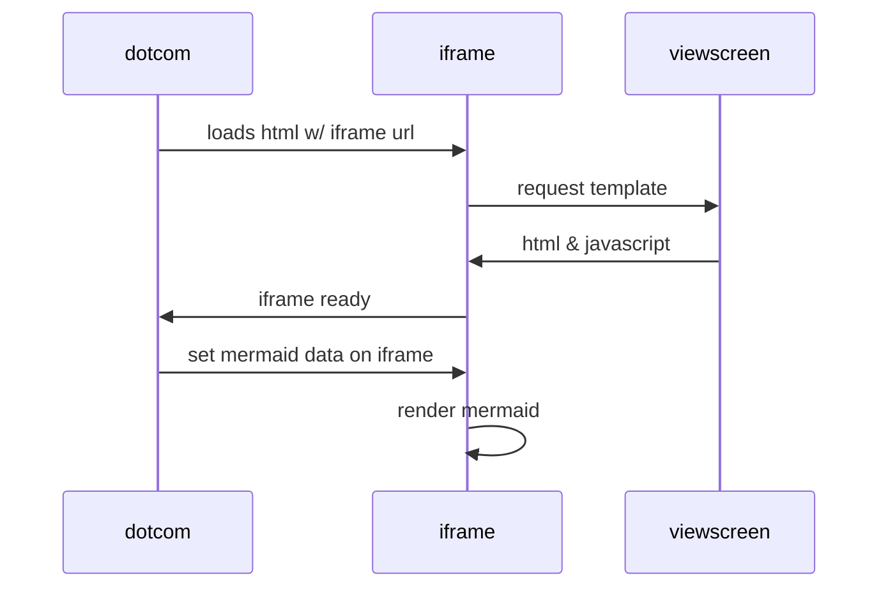

# diagrams

Playground for mermaid diagrams.

### References
* https://learning.oreilly.com/library/view/creating-software-with/9798888650219
* https://github.blog/2022-02-14-include-diagrams-markdown-files-mermaid/

